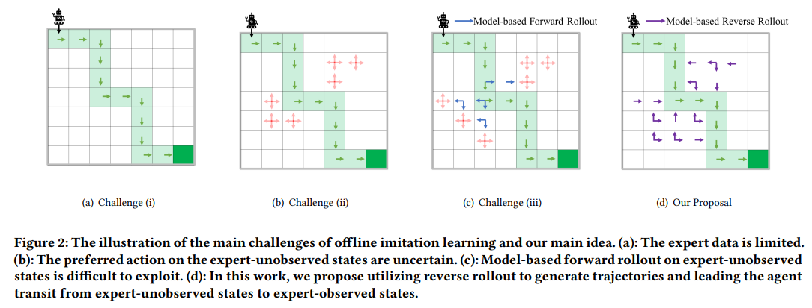

# SRA-KDD-2024

Code of the KDD2024 paper: **Offline Imitation Learning with Model-based Reverse Augmentation**

## Installation

    conda env create -f sra-environment.yml

## Scripts for Main Results

    bash sra_iql_maze.sh
    bash sra_iql_mujoco.sh
